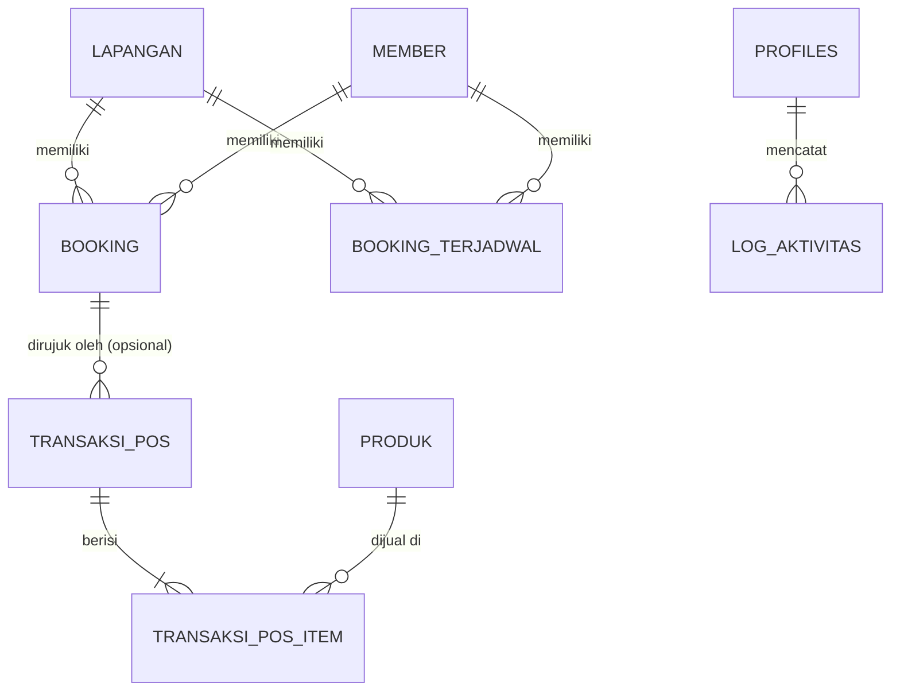

# Product Requirements Document (PRD)
# Aplikasi Booking Sorga Desa Belega

| | |
|---|---|
| **Nama Produk** | App Booking Sorga Desa Belega |
| **Jenis Sistem** | Sistem Booking Lapangan Badminton & Point of Sale (POS) |
| **Versi Dokumen** | 2.1 (Selesai Dibangun, Hardened & Production Ready) |
| **Tanggal** | 26 Agustus 2026 |
| **Status** | 🟢 Selesai, Hardened, SEO Ready & Siap Deploy ke Shared Hosting |
| **Tech Stack** | React JS (Vite) + Tailwind CSS (Frontend) + Supabase (Backend, DB, Auth, Storage) |
| **Target Deployment**| Shared Hosting cPanel (Frontend) + Supabase Cloud (Backend & Database) |

---

## 1. Ringkasan Eksekutif

### 1.1 Latar Belakang
Sorga Desa Belega (terletak di Gianyar, Bali) telah berhasil menyelesaikan migrasi sistem dari platform Google Apps Script (GAS) dan Google Sheets ke arsitektur modern berbasis **React JS + Tailwind CSS** di sisi frontend dan **Supabase** di sisi backend. Migrasi ini telah mengatasi limitasi Apps Script (kuota eksekusi harian, pembacaan sel lembar kerja yang lambat, dan masalah skalabilitas), sekaligus menghadirkan antarmuka pengguna yang sangat responsif, andal, dan terasa seperti aplikasi *mobile native* di HP pelanggan.

### 1.2 Tujuan Migrasi & Pencapaian
1. **Performa Tinggi:** Mengganti Google Sheets yang lambat dengan PostgreSQL di Supabase untuk pencarian jadwal instan (<100ms).
2. **Keamanan Handal:** Menerapkan Row Level Security (RLS) multi-role di Supabase, Security Definer Helper functions (`is_staff()`, `is_admin()`), View publik tanpa PII (`public_jadwal_lapangan`), dan Trigger anti-privilege escalation guna memproteksi data pemesanan internal, data staf, dan data keuangan dari akses luar yang tidak sah.
3. **Pengalaman Pengguna (UX) Premium:** Membangun antarmuka landing page dengan gaya *glassmorphism* di React yang terasa halus, menggunakan interaksi mikro (*micro-animations*), carousel testimoni multi-platform responsif, dan dioptimalkan agar terasa seperti aplikasi *mobile native* di layar HP.
4. **Kasir POS & Stok Terintegrasi:** Menyediakan fitur POS (Point of Sale) kasir dengan validasi stok *real-time* yang aman (*race-condition safe*) menggunakan trigger relasional PostgreSQL (`SELECT FOR UPDATE`).
5. **Kemudahan Pengelolaan & Otomatisasi:** Menggunakan database relasional murni di Supabase untuk laporan penjualan dan okupansi lapangan, menjadwalkan pembukaan slot member menggunakan cron job database (`pg_cron`), serta pembatalan otomatis untuk booking pending yang kadaluarsa (>2 jam).
6. **Optimasi SEO Google Lengkap:** Dilengkapi dengan struktur On-Page & Technical SEO (Schema.org JSON-LD `SportsActivityLocation` & `LocalBusiness`, Open Graph, `sitemap.xml`, `robots.txt`, dan `.htaccess` SPA routing) agar siap diindeks di Google Search Console.

### 1.3 Asumsi & Batasan Desain (Terimplementasi)
- **Konfirmasi Pembayaran:** Menggunakan **metode manual** (Transfer Bank / Bayar di Tempat). Detail bank (Nama Bank, Nomor Rekening, Atas Nama) dapat dikonfigurasi secara dinamis dari Dashboard Admin dan disinkronkan ke Bottom Sheet Modal landing page lengkap dengan fitur 1-click *Copy Rekening*. Status awal pemesanan dari landing page adalah `Pending` dan `Belum Bayar`.
- **Registrasi Pelanggan:** Bersifat **Guest-only**. Pelanggan tidak perlu login atau mendaftar akun untuk memesan lapangan. Mereka cukup memasukkan Nama dan Nomor WA. Dashboard Admin mengidentifikasi histori pemesanan berdasarkan nomor WA tersebut.
- **Privasi Data Pelanggan:** Pengunjung publik di landing page membaca jadwal ketersediaan melalui View khusus database (`public_jadwal_lapangan`) yang menyembunyikan Nama dan Nomor HP pemesan demi menjaga privasi pelanggan.
- **Deployment Frontend:** Dihosting di **Shared Hosting** cPanel milik pengelola (Domain target: `https://sorgadesa.belega.id/`). Seluruh aset build React (`dist/`) diunggah ke shared hosting lengkap dengan file `.htaccess`, sedangkan API, Auth, Database, dan File Storage berjalan di Supabase Cloud.

---

## 2. Ruang Lingkup Sistem

Sistem ini terbagi menjadi dua bagian besar dengan fungsionalitas yang terverifikasi lengkap:

### 2.1 Landing Page Publik (Akses Publik, Tanpa Login)
- **Desain Khusus HP (Mobile-App Feel):** Tampilan mobile menggunakan bilah navigasi bawah (*Bottom Tab Bar*) fixed dengan tombol *Floating Action Button (FAB)* menonjol di tengah untuk langsung memesan.
- **Kalender Jadwal Interaktif:** Berbentuk grid literal mirip papan skor bulu tangkis (Kolom = Lapangan, Baris = Slot Waktu per 30 menit). Menampilkan status lapangan secara *real-time*:
  - **Tersedia:** Sel kosong dengan hover ikon `+` (klik untuk membuka formulir pemesanan).
  - **Pending:** Berwarna kuning oranye, tidak bisa diklik.
  - **Terisi/Dikonfirmasi:** Berwarna merah bata, menampilkan teks "Terisi" untuk menjaga privasi. (Durasi sewa minimal 30 menit dan harus kelipatan 30 menit).
- **Formulir Pemesanan (Modal Sheet):** Formulir muncul sebagai *Bottom Sheet Modal* (naik dari bawah layar) pada mobile agar mudah ditekan satu tangan, dilengkapi rincian rekening pembayaran dinamis dan tombol salin nomor rekening.
- **Galeri & Testimoni Modern:**
  - Galeri fasilitas lapangan diambil dinamis dari Supabase Storage (bucket `assets`).
  - Testimoni disaring oleh Admin dengan kartu *clean luxury*, rotasi watermark tanda kutip, rating bintang 5, badge platform (Instagram, Facebook, X/Twitter, Google Maps), serta navigasi carousel snap (3 kartu desktop, 2 kartu mobile).
- **Teks & Konten Dinamis:** Seluruh kata, deskripsi, sub-heading, dan judul section (Hero, Lapangan, Jadwal, Galeri, Testimoni, Kontak) serta gambar background Hero dapat diubah secara dinamis dari dashboard pengelola.
- **Kontak & Media Sosial Dinamis:** WhatsApp Admin, iframe Google Maps embed, serta tautan media sosial (Instagram, Facebook, Google Maps) diintegrasikan secara dinamis dari tabel `pengaturan`.
- **SEO Ready:** Siap Google Search Console dengan meta tags lengkap, Open Graph preview WA/sosmed, JSON-LD Structured Data, `sitemap.xml`, dan `robots.txt`.

### 2.2 Dashboard Admin (Akses Terproteksi, Wajib Login)
- **Autentikasi Staf:** Login menggunakan akun terdaftar di Supabase Auth dengan pembagian peran (Super Admin, Admin, Kasir) dan trigger proteksi peran (`protect_profile_role`).
- **Paginasi Tabel (Paging):** Seluruh tabel di dashboard admin (Booking, Jadwal Rutin, Produk, Staf, Lapangan) dilengkapi kontrol paginasi premium (ukuran halaman 5 atau 10 baris) serta fitur reset halaman otomatis saat filter pencarian/kategori berubah.
- **Kelola Lapangan & Pemeliharaan:**
  - Menambah (`addCourt`) dan memperbarui (`updateCourt`) data lapangan dengan sanitasi tanggal pemeliharaan (`tanggal_tutup_mulai`, `tanggal_tutup_selesai`).
  - Tombol pintasan Edit Data Lapangan langsung pada panel ketersediaan.
- **Kelola Pemesanan (Booking):**
  - Melihat daftar seluruh booking dengan filter tanggal dan status.
  - Mengubah status pemesanan (`Pending`, `Dikonfirmasi`, `Dibatalkan`, `Selesai`) dan pembayaran (`Belum Bayar`, `DP`, `Lunas`).
  - Menginput pemesanan manual untuk walk-in customer.
- **Kelola Jadwal Rutin Member (Recurring):**
  - Pendaftaran jadwal tetap member dengan waktu sewa kelipatan 30 menit (misal: Lapangan 1 tiap hari Senin jam 18:30 - 20:00).
  - Opsi pemicu manual (*trigger*) dengan antarmuka checklist untuk memilih jadwal aktif mana saja yang akan dijalankan.
  - Opsi pemilihan durasi generate slot booking (**7 Hari**, **30 Hari / 1 Bulan**, **90 Hari / 3 Bulan**) yang disimpan menggunakan method penyimpanan batch (`addBookingsBatch`).
- **Point of Sale (POS) Kasir:**
  - Kasir dapat memilih produk (Bola, Makanan, Minuman), menambahkannya ke keranjang belanja digital, dan memproses transaksi belanja.
  - Menghubungkan transaksi POS ke nomor booking tertentu (opsional).
  - Transaksi otomatis mengurangi stok barang dengan proteksi *race condition* (`SELECT FOR UPDATE` pada level database).
- **Laporan Finansial & Okupansi:**
  - Laporan omset sewa lapangan dan okupansi jam bermain per lapangan (mendukung pecahan desimal durasi).
  - Laporan omset penjualan produk POS beserta estimasi keuntungan kotor (Omset - Harga Modal) terhitung secara akurat berbasis database relasional.
  - Export laporan dan filter laporan berdasarkan rentang tanggal.
- **Pengaturan Sistem:**
  - Mengubah nama desa, alamat, nomor WhatsApp admin, jam operasional, serta informasi rekening pembayaran (Nama Bank, No Rekening, Atas Nama).
  - Mengunggah logo aplikasi dan gambar background hero langsung ke Supabase Storage (bucket `assets`) dengan validasi MIME & ukuran file (maks 5MB).
  - Mengelola ketersediaan lapangan (Tutup Sementara/Maintenance pada tanggal tertentu dengan alasan).
  - Mengelola foto galeri, testimoni, dan staf admin/kasir (Khusus Super Admin).
  - Tab Editor Konten Landing Page untuk semua tulisan dan link sosial media.

---

## 3. Arsitektur Teknologi & Database

### 3.1 Stack Teknologi
- **Frontend:** React JS (Vite), Tailwind CSS (Vanilla CSS untuk visual sistem), Lucide React (Ikon), React Router (Routing).
- **Backend & Database:** Supabase
  - **Supabase Database:** PostgreSQL untuk penyimpanan data relasional.
  - **Supabase Auth:** Autentikasi staf admin/kasir.
  - **Supabase Storage:** Storage Bucket `assets` untuk logo, background hero, gambar galeri, dan avatar testimoni (public read, authenticated upload).
  - **Supabase Edge Functions / pg_cron:** Ekstensi Postgres untuk mengotomatiskan pembuatan jadwal mingguan dan pembatalan otomatis booking expired.

### 3.2 Diagram Hubungan Entitas (ERD)



---

## 4. DDL Skema Database (PostgreSQL Supabase Terupdate)

Gunakan skema SQL berikut untuk menyiapkan basis data di Supabase SQL Editor.

```sql
-- 1. Tabel Lapangan
CREATE TABLE IF NOT EXISTS lapangan (
    id_lapangan VARCHAR(20) PRIMARY KEY,
    nama_lapangan VARCHAR(100) NOT NULL,
    status VARCHAR(20) DEFAULT 'Aktif' CHECK (status IN ('Aktif', 'Non-Aktif', 'Maintenance')),
    harga_per_jam NUMERIC(12, 2) NOT NULL,
    harga_member NUMERIC(12, 2) NOT NULL,
    keterangan TEXT,
    tanggal_tutup_mulai DATE,
    tanggal_tutup_selesai DATE,
    alasan_tutup TEXT
);

-- 2. Tabel Member
CREATE TABLE IF NOT EXISTS member (
    id_member UUID PRIMARY KEY DEFAULT gen_random_uuid(),
    nama VARCHAR(150) NOT NULL,
    no_hp VARCHAR(20) NOT NULL,
    tipe_member VARCHAR(20) DEFAULT 'Reguler' CHECK (tipe_member IN ('Reguler', 'VIP')),
    tanggal_daftar DATE DEFAULT CURRENT_DATE,
    status VARCHAR(20) DEFAULT 'Aktif' CHECK (status IN ('Aktif', 'Nonaktif'))
);

-- 3. Tabel Booking
CREATE TABLE IF NOT EXISTS booking (
    id_booking VARCHAR(50) PRIMARY KEY,
    id_lapangan VARCHAR(20) REFERENCES lapangan(id_lapangan) ON DELETE RESTRICT,
    tanggal DATE NOT NULL,
    jam_mulai TIME NOT NULL,
    jam_selesai TIME NOT NULL,
    nama_pemesan VARCHAR(150) NOT NULL,
    no_hp VARCHAR(20) NOT NULL,
    sumber_booking VARCHAR(50) DEFAULT 'Landing Page' CHECK (sumber_booking IN ('Landing Page', 'Admin', 'Terjadwal')),
    status_booking VARCHAR(20) DEFAULT 'Pending' CHECK (status_booking IN ('Pending', 'Dikonfirmasi', 'Dibatalkan', 'Selesai')),
    status_pembayaran VARCHAR(20) DEFAULT 'Belum Bayar' CHECK (status_pembayaran IN ('Belum Bayar', 'DP', 'Lunas')),
    nominal_dibayar NUMERIC(12, 2) DEFAULT 0,
    total_harga NUMERIC(12, 2) NOT NULL,
    id_member VARCHAR(50),
    catatan TEXT,
    dibuat_oleh VARCHAR(100) DEFAULT 'Sistem',
    created_at TIMESTAMP WITH TIME ZONE DEFAULT NOW()
);

-- 4. Tabel Booking Terjadwal (Recurring/Langganan Member)
CREATE TABLE IF NOT EXISTS booking_terjadwal (
    id_jadwal_tetap UUID PRIMARY KEY DEFAULT gen_random_uuid(),
    id_member UUID REFERENCES member(id_member) ON DELETE CASCADE,
    id_lapangan VARCHAR(20) REFERENCES lapangan(id_lapangan) ON DELETE CASCADE,
    hari VARCHAR(20) NOT NULL, -- Contoh: 'Senin', 'Selasa', dsb.
    jam_mulai TIME NOT NULL,
    jam_selesai TIME NOT NULL,
    tanggal_mulai_periode DATE NOT NULL,
    tanggal_akhir_periode DATE,
    status VARCHAR(20) DEFAULT 'Aktif' CHECK (status IN ('Aktif', 'Nonaktif')),
    catatan TEXT,
    created_at TIMESTAMP WITH TIME ZONE DEFAULT NOW()
);

-- 5. Tabel Produk POS
CREATE TABLE IF NOT EXISTS produk (
    id_produk UUID PRIMARY KEY DEFAULT gen_random_uuid(),
    kategori VARCHAR(50) NOT NULL CHECK (kategori IN ('Bola', 'Makanan', 'Minuman')),
    nama_produk VARCHAR(150) NOT NULL,
    harga_jual NUMERIC(12, 2) NOT NULL,
    harga_modal NUMERIC(12, 2) NOT NULL,
    stok INTEGER DEFAULT 0 CHECK (stok >= 0),
    satuan VARCHAR(20) DEFAULT 'Pcs',
    status VARCHAR(20) DEFAULT 'Aktif' CHECK (status IN ('Aktif', 'Nonaktif'))
);

-- 6. Tabel Transaksi POS
CREATE TABLE IF NOT EXISTS transaksi_pos (
    id_transaksi UUID PRIMARY KEY DEFAULT gen_random_uuid(),
    tanggal TIMESTAMP WITH TIME ZONE DEFAULT NOW(),
    id_booking VARCHAR(50) REFERENCES booking(id_booking) ON DELETE SET NULL,
    total_belanja NUMERIC(12, 2) NOT NULL,
    metode_bayar VARCHAR(20) DEFAULT 'Tunai' CHECK (metode_bayar IN ('Tunai', 'QRIS', 'Transfer')),
    kasir VARCHAR(100) NOT NULL,
    nama_konsumen VARCHAR(150)
);

-- 7. Tabel Item Transaksi POS (Hubungan Relasional Multi-Item)
CREATE TABLE IF NOT EXISTS transaksi_pos_item (
    id_transaksi_item UUID PRIMARY KEY DEFAULT gen_random_uuid(),
    id_transaksi UUID REFERENCES transaksi_pos(id_transaksi) ON DELETE CASCADE,
    id_produk UUID REFERENCES produk(id_produk) ON DELETE RESTRICT,
    qty INTEGER NOT NULL CHECK (qty > 0),
    harga_satuan NUMERIC(12, 2) NOT NULL,
    subtotal NUMERIC(12, 2) NOT NULL
);

-- 8. Tabel Profil Staf Pengguna (Menghubungkan Auth Supabase)
CREATE TABLE IF NOT EXISTS profiles (
    id UUID PRIMARY KEY REFERENCES auth.users(id) ON DELETE CASCADE,
    nama VARCHAR(150) NOT NULL,
    username VARCHAR(50) UNIQUE NOT NULL,
    role VARCHAR(20) NOT NULL CHECK (role IN ('Super Admin', 'Admin', 'Kasir')),
    status VARCHAR(20) DEFAULT 'Aktif' CHECK (status IN ('Aktif', 'Nonaktif')),
    created_at TIMESTAMP WITH TIME ZONE DEFAULT NOW()
);

-- 9. Tabel Log Aktivitas
CREATE TABLE IF NOT EXISTS log_aktivitas (
    id_log UUID PRIMARY KEY DEFAULT gen_random_uuid(),
    timestamp TIMESTAMP WITH TIME ZONE DEFAULT NOW(),
    user_nama VARCHAR(100) NOT NULL,
    aksi VARCHAR(150) NOT NULL,
    detail TEXT
);

-- 10. Tabel Pengaturan Aplikasi (Key-Value)
CREATE TABLE IF NOT EXISTS pengaturan (
    key VARCHAR(100) PRIMARY KEY,
    value TEXT NOT NULL,
    deskripsi TEXT
);

-- 11. Tabel Galeri Foto
CREATE TABLE IF NOT EXISTS galeri (
    id_foto UUID PRIMARY KEY DEFAULT gen_random_uuid(),
    url_foto TEXT NOT NULL,
    judul VARCHAR(150),
    urutan INTEGER DEFAULT 0,
    status VARCHAR(20) DEFAULT 'Aktif' CHECK (status IN ('Aktif', 'Nonaktif')),
    created_at TIMESTAMP WITH TIME ZONE DEFAULT NOW()
);

-- 12. Tabel Testimoni
CREATE TABLE IF NOT EXISTS testimoni (
    id_testimoni UUID PRIMARY KEY DEFAULT gen_random_uuid(),
    nama VARCHAR(150) NOT NULL,
    platform VARCHAR(50) DEFAULT 'Google Maps' CHECK (platform IN ('Facebook', 'Instagram', 'Google Maps', 'X/Twitter')),
    avatar_url TEXT,
    rating INTEGER DEFAULT 5 CHECK (rating >= 1 AND rating <= 5),
    komentar TEXT NOT NULL,
    urutan INTEGER DEFAULT 0,
    status VARCHAR(20) DEFAULT 'Pending' CHECK (status IN ('Pending', 'Aktif', 'Nonaktif')),
    created_at TIMESTAMP WITH TIME ZONE DEFAULT NOW()
);
```

---

## 5. Logika Bisnis Utama & Hardening Database

### 5.1 Validasi Anti-Bentrok Booking (Exclusion Constraint & Functions)
Pencegahan bentrok jadwal lapangan menggunakan formula interval terbuka `[jam_mulai, jam_selesai)` di level kernel database.

```sql
-- 1. Ekstensi untuk Exclusion Constraint
CREATE EXTENSION IF NOT EXISTS btree_gist;

-- 2. Helper function immutable rentang waktu (Overloads TIME & TEXT)
CREATE OR REPLACE FUNCTION booking_tsrange(p_tanggal DATE, p_jam_mulai TIME, p_jam_selesai TIME)
RETURNS tsrange IMMUTABLE LANGUAGE sql AS $$
    SELECT tsrange(p_tanggal + p_jam_mulai, p_tanggal + p_jam_selesai, '[)');
$$;

CREATE OR REPLACE FUNCTION booking_tsrange(p_tanggal DATE, p_jam_mulai TEXT, p_jam_selesai TEXT)
RETURNS tsrange IMMUTABLE LANGUAGE sql AS $$
    SELECT tsrange(p_tanggal + p_jam_mulai::time, p_tanggal + p_jam_selesai::time, '[)');
$$;

-- 3. Exclusion Constraint Level Kernel Database
DO $$
BEGIN
    IF NOT EXISTS (SELECT 1 FROM pg_constraint WHERE conname = 'no_double_booking') THEN
        ALTER TABLE booking 
        ADD CONSTRAINT no_double_booking 
        EXCLUDE USING gist (
            id_lapangan WITH =,
            (booking_tsrange(tanggal, jam_mulai, jam_selesai)) WITH &&
        ) WHERE (status_booking != 'Dibatalkan');
    END IF;
END $$;

-- 4. Fungsi Cek Bentrok Jadwal (Hardened Security Definer)
CREATE OR REPLACE FUNCTION cek_bentrok_jadwal(
    p_id_lapangan VARCHAR,
    p_tanggal DATE,
    p_jam_mulai TEXT,
    p_jam_selesai TEXT,
    p_ignore_booking_id VARCHAR DEFAULT NULL
) RETURNS BOOLEAN 
LANGUAGE plpgsql SECURITY DEFINER SET search_path = public, pg_temp AS $$
DECLARE
    v_bentrok BOOLEAN;
BEGIN
    SELECT EXISTS (
        SELECT 1 FROM booking
        WHERE id_lapangan = p_id_lapangan
          AND tanggal = p_tanggal
          AND status_booking != 'Dibatalkan'
          AND (jam_mulai::time) < (p_jam_selesai::time)
          AND (p_jam_mulai::time) < (jam_selesai::time)
          AND (p_ignore_booking_id IS NULL OR id_booking != p_ignore_booking_id)
    ) INTO v_bentrok;
    
    RETURN v_bentrok;
END;
$$;

-- 5. Trigger Kalkulasi Harga & Proteksi Status (Anti Price & Status Tampering)
CREATE OR REPLACE FUNCTION trigger_validasi_dan_hitung_harga()
RETURNS TRIGGER LANGUAGE plpgsql SECURITY DEFINER SET search_path = public, pg_temp AS $$
DECLARE
    v_harga_per_jam NUMERIC(12, 2);
    v_harga_member NUMERIC(12, 2);
    v_durasi_jam NUMERIC(6, 2);
    v_status_lapangan VARCHAR(20);
BEGIN
    SELECT harga_per_jam, harga_member, status 
    INTO v_harga_per_jam, v_harga_member, v_status_lapangan
    FROM lapangan WHERE id_lapangan = NEW.id_lapangan;

    IF v_harga_per_jam IS NULL THEN
        RAISE EXCEPTION 'Lapangan % tidak ditemukan!', NEW.id_lapangan;
    END IF;

    IF v_status_lapangan = 'Non-Aktif' THEN
        RAISE EXCEPTION 'Lapangan % sedang tidak aktif.', NEW.id_lapangan;
    END IF;

    v_durasi_jam := EXTRACT(EPOCH FROM (NEW.jam_selesai::time - NEW.jam_mulai::time)) / 3600.0;
    IF v_durasi_jam <= 0 THEN
        RAISE EXCEPTION 'Jam selesai harus lebih besar dari jam mulai!';
    END IF;

    IF NEW.sumber_booking = 'Terjadwal' THEN
        NEW.total_harga := v_durasi_jam * COALESCE(v_harga_member, v_harga_per_jam);
    ELSE
        NEW.total_harga := v_durasi_jam * v_harga_per_jam;
    END IF;

    IF NEW.sumber_booking = 'Landing Page' THEN
        NEW.status_booking := 'Pending';
        NEW.status_pembayaran := 'Belum Bayar';
        NEW.nominal_dibayar := 0;
        NEW.dibuat_oleh := 'Landing Page';
    END IF;

    RETURN NEW;
END;
$$;

DROP TRIGGER IF EXISTS enforce_booking_price ON booking;
CREATE TRIGGER enforce_booking_price
BEFORE INSERT ON booking
FOR EACH ROW EXECUTE FUNCTION trigger_validasi_dan_hitung_harga();
```

### 5.2 Pengurangan Stok POS Otomatis (`SELECT FOR UPDATE`)
```sql
CREATE OR REPLACE FUNCTION trigger_kurangi_stok_produk()
RETURNS TRIGGER AS $$
DECLARE
    v_stok_sekarang INTEGER;
    v_nama_produk VARCHAR;
BEGIN
    SELECT stok, nama_produk INTO v_stok_sekarang, v_nama_produk
    FROM produk WHERE id_produk = NEW.id_produk FOR UPDATE;

    IF v_stok_sekarang < NEW.qty THEN
        RAISE EXCEPTION 'Stok untuk % tidak mencukupi. Tersisa: %, diminta: %', v_nama_produk, v_stok_sekarang, NEW.qty;
    END IF;

    UPDATE produk SET stok = stok - NEW.qty WHERE id_produk = NEW.id_produk;
    RETURN NEW;
END;
$$ LANGUAGE plpgsql;

DROP TRIGGER IF EXISTS pos_item_decrease_stock ON transaksi_pos_item;
CREATE TRIGGER pos_item_decrease_stock
BEFORE INSERT ON transaksi_pos_item
FOR EACH ROW EXECUTE FUNCTION trigger_kurangi_stok_produk();
```

### 5.3 Pembersihan Booking Expired Otomatis (Anti Slot Hoarding / DoS)
Fungsi otomatis untuk membatalkan booking status `Pending` dari Landing Page yang telah lewat dari 2 jam tanpa konfirmasi pembayaran atau tanggal bukunya sudah terlampaui.

```sql
CREATE OR REPLACE FUNCTION auto_cancel_expired_pending_bookings()
RETURNS INTEGER LANGUAGE plpgsql SECURITY DEFINER SET search_path = public, pg_temp AS $$
DECLARE
    v_updated_count INTEGER := 0;
BEGIN
    UPDATE booking
    SET status_booking = 'Dibatalkan',
        catatan = COALESCE(catatan, '') || ' [Otomatis Dibatalkan: Batas Waktu Pembayaran Habis]'
    WHERE status_booking = 'Pending'
      AND status_pembayaran = 'Belum Bayar'
      AND sumber_booking = 'Landing Page'
      AND (created_at < NOW() - INTERVAL '2 hours' OR tanggal < CURRENT_DATE);

    GET DIAGNOSTICS v_updated_count = ROW_COUNT;
    
    IF v_updated_count > 0 THEN
        INSERT INTO log_aktivitas (user_nama, aksi, detail)
        VALUES ('Sistem Auto-Cancel', 'Pembersihan Booking Expired', 'Otomatis membatalkan ' || v_updated_count || ' booking pending kadaluarsa.');
    END IF;

    RETURN v_updated_count;
END;
$$;
```

### 5.4 Proteksi Eskalasi Peran Staf (`protect_profile_role`)
Mencegah kasir atau admin biasa mengubah role atau status akun mereka sendiri lewat API request.

```sql
CREATE OR REPLACE FUNCTION trigger_protect_profile_role()
RETURNS TRIGGER LANGUAGE plpgsql SECURITY DEFINER SET search_path = public, pg_temp AS $$
BEGIN
    IF (NEW.role IS DISTINCT FROM OLD.role) OR (NEW.status IS DISTINCT FROM OLD.status) THEN
        IF get_current_user_role() != 'Super Admin' THEN
            RAISE EXCEPTION 'Akses Ditolak: Hanya Super Admin yang berhak mengubah role atau status akun staf!';
        END IF;
    END IF;
    RETURN NEW;
END;
$$;

DROP TRIGGER IF EXISTS protect_profile_role ON profiles;
CREATE TRIGGER protect_profile_role
BEFORE UPDATE ON profiles
FOR EACH ROW EXECUTE FUNCTION trigger_protect_profile_role();
```

---

## 6. Row Level Security (RLS) & Matriks Hak Akses

### 6.1 Matriks Izin Akses Tabel & Storage

| Nama Tabel / Resource | Publik (Anon) | Kasir (Staf) | Admin / Super Admin |
|---|---|---|---|
| `public_jadwal_lapangan` (View) | `SELECT` | `SELECT` | `SELECT` |
| `lapangan` | `SELECT` | `SELECT` | `ALL` (CRUD) |
| `member` | None | `SELECT`, `INSERT` | `ALL` (CRUD) |
| `booking` | `INSERT` (`Landing Page`, `Pending`) | `SELECT`, `INSERT`, `UPDATE` | `ALL` (CRUD) |
| `booking_terjadwal` | None | `SELECT` | `ALL` (CRUD) |
| `produk` | None | `SELECT` | `ALL` (CRUD) |
| `transaksi_pos` | None | `SELECT`, `INSERT` | `ALL` (CRUD) |
| `transaksi_pos_item` | None | `SELECT`, `INSERT` | `ALL` (CRUD) |
| `profiles` | None | `SELECT` (Sendiri) | `ALL` (Super Admin) |
| `log_aktivitas` | `INSERT` | None | `SELECT` (Admin/Super Admin) |
| `pengaturan` | `SELECT` | `SELECT` | `ALL` (CRUD) |
| `galeri` | `SELECT` (Aktif) | `SELECT` | `ALL` (CRUD) |
| `testimoni` | `SELECT` (Aktif), `INSERT` (`Pending`) | `SELECT` | `ALL` (CRUD) |
| Storage Bucket `assets` | `SELECT` (Public URL) | `INSERT` (Images max 5MB) | `ALL` (CRUD) |

---

## 7. Desain Sistem Visual, UX & SEO Rules

### 7.1 Palet Warna Inti

| Nama Warna | Kode Hex | Peran Visual |
|---|---|---|
| `court-green` | `#1B4A3F` | Warna utama — hijau pekat lapangan sintetis. Hero bg, sidebar dashboard, header. |
| `rattan-gold` | `#B98B4E` | Warna sekunder — cokelat rotan Gianyar. Border aktif, ikon, aksen. |
| `shuttle-cream`| `#F7F4EC` | Latar utama — putih gading bulu kok. |
| `chalk-line` | `#F1EDE0` | Warna garis — putih kapur garis lapangan. |
| `net-charcoal` | `#22261F` | Teks utama — hitam arang kehijauan hangat. |
| `smash-lime` | `#C9DB4A` | Warna CTA — kuning-lime kok neon. Tombol utama & status "Tersedia". |

### 7.2 Spesifikasi SEO Google (Search Console Ready)
1. **Structured Data (JSON-LD):** Tipe `SportsActivityLocation` & `LocalBusiness` memuat nama lokasi, alamat Gianyar Bali, geo coordinates, kisaran harga, dan jam operasional.
2. **Open Graph & Twitter Cards:** Meta tags lengkap untuk pratinjau thumbnail saat link disebar di WhatsApp, Facebook, dan X.
3. **Technical Files:** `sitemap.xml` dan `robots.txt` disajikan di folder `public/` (otomatis masuk ke root build `dist/`).
4. **Hosting Routing (`.htaccess`):** Konfigurasi cPanel HTTPS redirect, SPA fallback routing (`RewriteEngine On`, `RewriteRule ^ index.html [L]`), serta kompresi Gzip.

---

## 8. Panduan Struktur Proyek React (Aktual)

```
/Sorga-Desa-Supabase
├── index.html                    # SEO Metadata, Schema.org JSON-LD
├── package.json
├── vite.config.js                # Watcher ignore config untuk Windows
├── public/
│   ├── favicon.ico
│   ├── robots.txt                # Technical SEO
│   └── sitemap.xml               # Sitemap Google Search Console
├── src/
│   ├── main.jsx
│   ├── App.jsx
│   ├── index.css                 # Custom CSS (Glassmorphism, animations)
│   │
│   ├── components/               # Komponen Reusable
│   │   ├── BottomTabBar.jsx      # Navigasi bawah layar mobile
│   │   ├── GlassCard.jsx         # Card pembungkus glassmorphism
│   │   ├── ScoreboardGrid.jsx    # Grid jadwal interaktif
│   │   ├── BottomSheetModal.jsx  # Popup sheet & copy rekening
│   │   └── ModernHero.jsx        # Intro Hero dynamic background & badges
│   │
│   ├── layouts/
│   │   └── DashboardLayout.jsx   # Layout admin & sidebar
│   │
│   ├── pages/
│   │   ├── LandingPage.jsx       # Public landing page utama
│   │   ├── LoginAdmin.jsx        # Halaman login staf
│   │   │
│   │   └── dashboard/            # Panel Admin internal
│   │       ├── DashboardOverview.jsx
│   │       ├── KelolaBooking.jsx
│   │       ├── KelolaSchedules.jsx
│   │       ├── PointOfSale.jsx
│   │       ├── LaporanKeuangan.jsx
│   │       └── PengaturanSistem.jsx
│   │
│   └── utils/
│       ├── alertHelper.js        # Utilitas notifikasi UI
│       ├── dateHelper.js         # Format tanggal & jam
│       ├── db.js                 # Handler Supabase & LocalStorage Fallback
│       ├── logoHelper.js         # Logo default & favicon handler
│       ├── mockData.js           # Sandbox mock dataset
│       ├── reportExportHelper.js # Handler ekspor laporan PDF/Excel
│       └── supabaseClient.js     # Supabase Client SDK Config
└── supabase/
    └── migrations/               # SQL Security & Hardening Migrations
        ├── 01_phase1_security_hardening.sql
        ├── 02_phase2_rls_and_privacy.sql
        ├── 03_phase3_storage_and_automation.sql
        └── 04_phase4_final_hardening.sql
```

---

## 9. Panduan Deployment Ke Shared Hosting cPanel

1. **Jalankan Build Production:** Run `npm run build` di terminal untuk menghasilkan folder `dist/`.
2. **Unggah ke Shared Hosting:**
   - Masuk ke File Manager cPanel -> Buka direktori root domain (misal: `public_html/sorgadesa.belega.id`).
   - Unggah file zip dari folder `dist/` dan ekstrak seluruh aset.
3. **Verifikasi `.htaccess`:** Pastikan file `.htaccess` dari folder `dist/` sudah terunggah untuk menangani SPA Routing.
4. **Submit Google Search Console:** Daftarkan `https://sorgadesa.belega.id/sitemap.xml` di Google Search Console.
