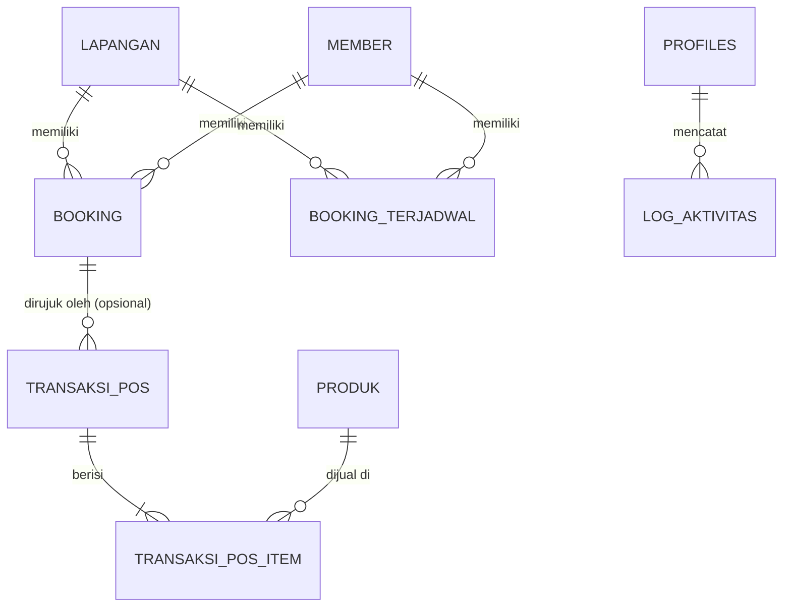

# Product Requirements Document (PRD)
# Aplikasi Booking Sorga Desa Belega

| | |
|---|---|
| **Nama Produk** | App Booking Sorga Desa Belega |
| **Jenis Sistem** | Sistem Booking Lapangan Badminton & Point of Sale (POS) |
| **Versi Dokumen** | 2.0 (Migrasi ke React + Supabase) |
| **Tanggal** | 18 Agustus 2026 |
| **Status** | Final untuk Implementasi |
| **Tech Stack** | React JS (Vite) + Tailwind CSS (Frontend) + Supabase (Backend, DB, Auth, Storage) |
| **Target Deployment**| Shared Hosting (Frontend) + Supabase Cloud (Backend & Database) |

---

## 1. Ringkasan Eksekutif

### 1.1 Latar Belakang
Sorga Desa Belega (terletak di Gianyar, Bali) memerlukan migrasi sistem dari platform Google Apps Script (GAS) dan Google Sheets yang lama ke arsitektur modern berbasis **React JS + Tailwind CSS** di sisi frontend dan **Supabase** di sisi backend. Migrasi ini bertujuan untuk mengatasi limitasi Apps Script (kuota eksekusi harian, pembacaan sel lembar kerja yang lambat, dan masalah skalabilitas), sekaligus menghadirkan antarmuka pengguna yang sangat responsif, andal, dan terasa seperti aplikasi *mobile native* di HP pelanggan.

### 1.2 Tujuan Migrasi
1. **Performa Tinggi:** Mengganti Google Sheets yang lambat dengan PostgreSQL di Supabase untuk pencarian jadwal instan (<100ms).
2. **Keamanan Handal:** Menerapkan Row Level Security (RLS) di Supabase guna memproteksi data pemesanan internal dan data keuangan dari akses luar yang tidak sah.
3. **Pengalaman Pengguna (UX) Premium:** Membangun antarmuka landing page dengan gaya *glassmorphism* di React yang terasa halus, menggunakan interaksi mikro (micro-animations), dan dioptimalkan agar terasa seperti aplikasi *mobile native* di layar HP.
4. **Kasir POS & Stok Terintegrasi:** Menyediakan fitur POS (Point of Sale) kasir dengan validasi stok *real-time* yang aman (*race-condition safe*) menggunakan trigger relasional PostgreSQL.
5. **Kemudahan Pengelolaan:** Menggunakan database relasional murni di Supabase untuk kemudahan laporan penjualan dan okupansi lapangan, serta menjadwalkan pembukaan slot member menggunakan pemicu cron job database (`pg_cron`).

### 1.3 Asumsi & Batasan Desain (Hasil Diskusi)
- **Konfirmasi Pembayaran:** Tetap menggunakan **metode manual**. Pelanggan memesan secara mandiri, lalu membayar secara manual (transfer bank / bayar di tempat) dan mengunggah bukti bayar secara manual (atau diverifikasi langsung oleh Admin di tempat). Status awal pemesanan dari landing page adalah `Pending` dan `Belum Bayar`.
- **Registrasi Pelanggan:** Bersifat **Guest-only**. Pelanggan tidak perlu login atau mendaftar akun untuk memesan lapangan. Mereka cukup memasukkan Nama dan Nomor WA. Dashboard Admin akan mengidentifikasi histori pemesanan berdasarkan nomor WA tersebut.
- **Deployment Frontend:** Dihosting di **Shared Hosting** milik pengguna. Seluruh aset build React akan diunggah ke shared hosting, sedangkan API, Auth, Database, dan File Storage berjalan di Supabase Cloud.

---

## 2. Ruang Lingkup Sistem

Sistem ini terbagi menjadi dua bagian besar dengan fungsionalitas yang berbeda:

### 2.1 Landing Page Publik (Akses Publik, Tanpa Login)
- **Desain Khusus HP (Mobile-App Feel):** Tampilan mobile tidak boleh sekadar versi desktop yang mengecil. Menggunakan bilah navigasi bawah (*Bottom Tab Bar*) yang fixed dengan tombol *Floating Action Button (FAB)* menonjol di tengah untuk langsung memesan.
- **Kalender Jadwal Interaktif:** Berbentuk grid literal mirip papan skor bulu tangkis (Kolom = Lapangan, Baris = Slot Waktu per 30 menit). Menampilkan status lapangan secara *real-time*:
  - **Tersedia:** Sel kosong dengan hover ikon `+` (klik untuk membuka formulir pemesanan).
  - **Pending:** Berwarna kuning oranye, tidak bisa diklik.
  - **Terisi/Dikonfirmasi:** Berwarna merah bata, menampilkan teks "Terisi" untuk menjaga privasi. (Durasi sewa minimal 30 menit dan harus kelipatan 30 menit).
- **Formulir Pemesanan (Modal Sheet):** Formulir muncul sebagai *Bottom Sheet Modal* (naik dari bawah layar) pada mobile agar mudah ditekan satu tangan.
- **Galeri & Testimoni:** Bagian publik untuk menampilkan dokumentasi fasilitas lapangan (diambil dari Supabase Storage) dan testimoni pelanggan yang disaring oleh Admin.
- **Teks & Konten Dinamis:** Seluruh kata, deskripsi, sub-heading, dan judul section (dari Hero, Lapangan, Jadwal, Galeri, Testimoni, hingga Kontak) dapat diubah secara dinamis dari dashboard pengelola.
- **Kontak & Media Sosial Dinamis:** WhatsApp Admin serta tautan media sosial (Instagram, Facebook, Google Maps) diintegrasikan secara dinamis dari tabel pengaturan database.

### 2.2 Dashboard Admin (Akses Terproteksi, Wajib Login)
- **Autentikasi Staf:** Login menggunakan akun terdaftar di Supabase Auth dengan pembagian peran (Super Admin, Admin, Kasir).
- **Paginasi Tabel (Paging):** Seluruh tabel di dashboard admin dilengkapi kontrol paginasi premium (ukuran halaman 5 atau 10 baris) serta fitur reset halaman otomatis saat filter pencarian/kategori berubah.
- **Kelola Pemesanan (Booking):**
  - Melihat daftar seluruh booking dengan filter tanggal dan status.
  - Mengubah status pemesanan (`Pending`, `Dikonfirmasi`, `Dibatalkan`, `Selesai`) dan pembayaran (`Belum Bayar`, `DP`, `Lunas`).
  - Menginput pemesanan manual untuk walk-in customer.
- **Kelola Jadwal Rutin Member (Recurring):**
  - Pendaftaran jadwal tetap member dengan waktu sewa kelipatan 30 menit (misal: Lapangan 1 tiap hari Senin jam 18:30 - 20:00).
  - Opsi pemicu manual (*trigger*) dengan antarmuka checklist untuk memilih jadwal aktif mana saja yang akan dijalankan.
  - Opsi pemilihan durasi generate slot booking (**7 Hari**, **30 Hari / 1 Bulan**, **90 Hari / 3 Bulan**) yang disimpan menggunakan method penyimpanan batch (`addBookingsBatch`).
- **Point of Sale (POS) Kasir:**
  - Kasir dapat memilih produk (bola, Makanan, Minuman), menambahkan-nya ke keranjang belanja digital, dan memproses transaksi belanja.
  - Menghubungkan transaksi POS ke nomor booking tertentu (opsional).
  - Transaksi otomatis mengurangi stok barang dengan proteksi *race condition*.
- **Laporan Finansial & Okupansi:**
  - Laporan omset sewa lapangan dan okupansi jam bermain per lapangan (mendukung pecahan desimal durasi).
  - Laporan omset penjualan produk POS beserta estimasi keuntungan kotor (Omset - Harga Modal) terhitung secara akurat berbasis database relasional.
  - Filter laporan berdasarkan rentang tanggal.
- **Pengaturan Sistem:**
  - Mengubah nama desa, alamat, nomor WhatsApp admin, dan jam operasional.
  - Mengelola ketersediaan lapangan (Tutup Sementara/Maintenance pada tanggal tertentu dengan alasan).
  - Mengelola foto galeri, testimoni, dan staf admin/kasir (Khusus Super Admin).
  - **Tab Editor Konten Landing Page:** Form input teks terkelompok untuk mengatur semua tulisan dan link sosial media (Instagram, Facebook, Google Maps) di Landing Page publik.

---

## 3. Arsitektur Teknologi & Database

### 3.1 Stack Teknologi
- **Frontend:** React JS (Vite), Tailwind CSS (Vanilla CSS untuk visual sistem), Lucide React (Ikon), React Router (Routing).
- **Backend & Database:** Supabase
  - **Supabase Database:** PostgreSQL untuk penyimpanan data relasional.
  - **Supabase Auth:** Autentikasi staf admin/kasir.
  - **Supabase Storage:** Penyimpanan gambar galeri, avatar testimoni, dan bukti transfer.
  - **Supabase Edge Functions / pg_cron:** Ekstensi Postgres untuk mengotomatiskan pembuatan jadwal mingguan.

### 3.2 Diagram Hubungan Entitas (ERD)



---

## 4. DDL Skema Database (PostgreSQL Supabase)

Gunakan skema SQL berikut untuk menyiapkan basis data di Supabase SQL Editor.

```sql
-- 1. Tabel Lapangan
CREATE TABLE lapangan (
    id_lapangan VARCHAR(20) PRIMARY KEY,
    nama_lapangan VARCHAR(100) NOT NULL,
    status VARCHAR(20) DEFAULT 'Aktif' CHECK (status IN ('Aktif', 'Non-Aktif', 'Maintenance')),
    harga_per_jam NUMERIC(12, 2) NOT NULL,
    harga_member NUMERIC(12, 2) NOT NULL,
    keterangan TEXT,
    tanggal_tutup_mulai DATE,
    tanggal_tutup_selesai DATE,
    alasan_tutup TEXT
);

-- 2. Tabel Member
CREATE TABLE member (
    id_member UUID PRIMARY KEY DEFAULT gen_random_uuid(),
    nama VARCHAR(150) NOT NULL,
    no_hp VARCHAR(20) NOT NULL,
    tipe_member VARCHAR(20) DEFAULT 'Reguler' CHECK (tipe_member IN ('Reguler', 'VIP')),
    tanggal_daftar DATE DEFAULT CURRENT_DATE,
    status VARCHAR(20) DEFAULT 'Aktif' CHECK (status IN ('Aktif', 'Nonaktif'))
);

-- 3. Tabel Booking
CREATE TABLE booking (
    id_booking VARCHAR(50) PRIMARY KEY,
    id_lapangan VARCHAR(20) REFERENCES lapangan(id_lapangan) ON DELETE RESTRICT,
    tanggal DATE NOT NULL,
    jam_mulai TIME NOT NULL,
    jam_selesai TIME NOT NULL,
    nama_pemesan VARCHAR(150) NOT NULL,
    no_hp VARCHAR(20) NOT NULL,
    sumber_booking VARCHAR(50) DEFAULT 'Landing Page' CHECK (sumber_booking IN ('Landing Page', 'Admin', 'Terjadwal')),
    status_booking VARCHAR(20) DEFAULT 'Pending' CHECK (status_booking IN ('Pending', 'Dikonfirmasi', 'Dibatalkan', 'Selesai')),
    status_pembayaran VARCHAR(20) DEFAULT 'Belum Bayar' CHECK (status_pembayaran IN ('Belum Bayar', 'DP', 'Lunas')),
    nominal_dibayar NUMERIC(12, 2) DEFAULT 0,
    total_harga NUMERIC(12, 2) NOT NULL,
    id_member UUID REFERENCES member(id_member) ON DELETE SET NULL,
    catatan TEXT,
    dibuat_oleh VARCHAR(100) DEFAULT 'Sistem',
    created_at TIMESTAMP WITH TIME ZONE DEFAULT NOW()
);

-- 4. Tabel Booking Terjadwal (Recurring/Langganan Member)
CREATE TABLE booking_terjadwal (
    id_jadwal_tetap UUID PRIMARY KEY DEFAULT gen_random_uuid(),
    id_member UUID REFERENCES member(id_member) ON DELETE CASCADE,
    id_lapangan VARCHAR(20) REFERENCES lapangan(id_lapangan) ON DELETE CASCADE,
    hari VARCHAR(20) NOT NULL, -- Contoh: 'Senin', 'Selasa', dsb.
    jam_mulai TIME NOT NULL,
    jam_selesai TIME NOT NULL,
    tanggal_mulai_periode DATE NOT NULL,
    tanggal_akhir_periode DATE,
    status VARCHAR(20) DEFAULT 'Aktif' CHECK (status IN ('Aktif', 'Nonaktif')),
    catatan TEXT,
    created_at TIMESTAMP WITH TIME ZONE DEFAULT NOW()
);

-- 5. Tabel Produk POS
CREATE TABLE produk (
    id_produk UUID PRIMARY KEY DEFAULT gen_random_uuid(),
    kategori VARCHAR(50) NOT NULL CHECK (kategori IN ('Bola', 'Makanan', 'Minuman')),
    nama_produk VARCHAR(150) NOT NULL,
    harga_jual NUMERIC(12, 2) NOT NULL,
    harga_modal NUMERIC(12, 2) NOT NULL,
    stok INTEGER DEFAULT 0 CHECK (stok >= 0),
    satuan VARCHAR(20) DEFAULT 'Pcs',
    status VARCHAR(20) DEFAULT 'Aktif' CHECK (status IN ('Aktif', 'Nonaktif'))
);

-- 6. Tabel Transaksi POS
CREATE TABLE transaksi_pos (
    id_transaksi UUID PRIMARY KEY DEFAULT gen_random_uuid(),
    tanggal TIMESTAMP WITH TIME ZONE DEFAULT NOW(),
    id_booking VARCHAR(50) REFERENCES booking(id_booking) ON DELETE SET NULL,
    total_belanja NUMERIC(12, 2) NOT NULL,
    metode_bayar VARCHAR(20) DEFAULT 'Tunai' CHECK (metode_bayar IN ('Tunai', 'QRIS', 'Transfer')),
    kasir VARCHAR(100) NOT NULL,
    nama_konsumen VARCHAR(150)
);

-- 7. Tabel Item Transaksi POS (Hubungan Relasional Multi-Item)
CREATE TABLE transaksi_pos_item (
    id_transaksi_item UUID PRIMARY KEY DEFAULT gen_random_uuid(),
    id_transaksi UUID REFERENCES transaksi_pos(id_transaksi) ON DELETE CASCADE,
    id_produk UUID REFERENCES produk(id_produk) ON DELETE RESTRICT,
    qty INTEGER NOT NULL CHECK (qty > 0),
    harga_satuan NUMERIC(12, 2) NOT NULL,
    subtotal NUMERIC(12, 2) NOT NULL
);

-- 8. Tabel Profil Staf Pengguna (Menghubungkan Auth Supabase)
CREATE TABLE profiles (
    id UUID PRIMARY KEY REFERENCES auth.users(id) ON DELETE CASCADE,
    nama VARCHAR(150) NOT NULL,
    username VARCHAR(50) UNIQUE NOT NULL,
    role VARCHAR(20) NOT NULL CHECK (role IN ('Super Admin', 'Admin', 'Kasir')),
    status VARCHAR(20) DEFAULT 'Aktif' CHECK (status IN ('Aktif', 'Nonaktif')),
    created_at TIMESTAMP WITH TIME ZONE DEFAULT NOW()
);

-- 9. Tabel Log Aktivitas
CREATE TABLE log_aktivitas (
    id_log UUID PRIMARY KEY DEFAULT gen_random_uuid(),
    timestamp TIMESTAMP WITH TIME ZONE DEFAULT NOW(),
    user_nama VARCHAR(100) NOT NULL,
    aksi VARCHAR(150) NOT NULL,
    detail TEXT
);

-- 10. Tabel Pengaturan Aplikasi (Key-Value)
CREATE TABLE pengaturan (
    key VARCHAR(100) PRIMARY KEY,
    value TEXT NOT NULL,
    deskripsi TEXT
);

-- 11. Tabel Galeri Foto
CREATE TABLE galeri (
    id_foto UUID PRIMARY KEY DEFAULT gen_random_uuid(),
    url_foto TEXT NOT NULL,
    judul VARCHAR(150),
    urutan INTEGER DEFAULT 0,
    status VARCHAR(20) DEFAULT 'Aktif' CHECK (status IN ('Aktif', 'Nonaktif')),
    created_at TIMESTAMP WITH TIME ZONE DEFAULT NOW()
);

-- 12. Tabel Testimoni
CREATE TABLE testimoni (
    id_testimoni UUID PRIMARY KEY DEFAULT gen_random_uuid(),
    nama VARCHAR(150) NOT NULL,
    platform VARCHAR(50) NOT NULL CHECK (platform IN ('Facebook', 'Instagram', 'Google Maps')),
    avatar_url TEXT,
    rating INTEGER DEFAULT 5 CHECK (rating >= 1 AND rating <= 5),
    komentar TEXT NOT NULL,
    urutan INTEGER DEFAULT 0,
    status VARCHAR(20) DEFAULT 'Pending' CHECK (status IN ('Pending', 'Aktif', 'Nonaktif')),
    created_at TIMESTAMP WITH TIME ZONE DEFAULT NOW()
);

-- 13. Tabel Sosial Media (DEPRECATED - Sekarang diatur dinamis di tabel `pengaturan` secara Key-Value)
-- CREATE TABLE sosialmedia (
--     id_sosmed UUID PRIMARY KEY DEFAULT gen_random_uuid(),
--     platform VARCHAR(50) NOT NULL,
--     url TEXT NOT NULL,
--     urutan INTEGER DEFAULT 0,
--     status VARCHAR(20) DEFAULT 'Aktif' CHECK (status IN ('Aktif', 'Nonaktif'))
-- );
```

---

## 5. Logika Bisnis Utama (PostgreSQL Stored Procedures & Triggers)

### 5.1 Validasi Anti-Bentrok Booking (Pencegahan Double-Booking)
Pencegahan bentrok jadwal lapangan menggunakan formula logika interval terbuka di mana booking baru `(jam_mulai_baru, jam_selesai_baru)` bertumpang tindih dengan booking lama `(jam_mulai_lama, jam_selesai_lama)` jika:
$$\text{jam\_mulai\_baru} < \text{jam\_selesai\_lama} \quad \text{dan} \quad \text{jam\_mulai\_lama} < \text{jam\_selesai\_baru}$$

Gunakan fungsi database ini untuk memeriksa konflik:

```sql
-- 1. Ekstensi untuk Exclusion Constraint
CREATE EXTENSION IF NOT EXISTS btree_gist;

-- 2. Helper function immutable rentang waktu
CREATE OR REPLACE FUNCTION booking_tsrange(p_tanggal DATE, p_jam_mulai TIME, p_jam_selesai TIME)
RETURNS tsrange IMMUTABLE LANGUAGE sql AS $$
    SELECT tsrange(p_tanggal + p_jam_mulai, p_tanggal + p_jam_selesai, '[)');
$$;

-- 3. Exclusion Constraint Level Kernel Database (Pencegahan Double-Booking / Race-Condition Safe)
ALTER TABLE booking 
ADD CONSTRAINT no_double_booking 
EXCLUDE USING gist (
    id_lapangan WITH =,
    (booking_tsrange(tanggal, jam_mulai, jam_selesai)) WITH &&
) WHERE (status_booking != 'Dibatalkan');

-- 4. Fungsi Cek Bentrok Jadwal (Hardened Security Definer)
CREATE OR REPLACE FUNCTION cek_bentrok_jadwal(
    p_id_lapangan VARCHAR,
    p_tanggal DATE,
    p_jam_mulai TIME,
    p_jam_selesai TIME,
    p_ignore_booking_id VARCHAR DEFAULT NULL
) RETURNS BOOLEAN AS $$
DECLARE
    v_bentrok BOOLEAN;
BEGIN
    SELECT EXISTS (
        SELECT 1 FROM booking
        WHERE id_lapangan = p_id_lapangan
          AND tanggal = p_tanggal
          AND status_booking != 'Dibatalkan'
          AND jam_mulai < p_jam_selesai
          AND p_jam_mulai < jam_selesai
          AND (p_ignore_booking_id IS NULL OR id_booking != p_ignore_booking_id)
    ) INTO v_bentrok;
    
    RETURN v_bentrok;
END;
$$ LANGUAGE plpgsql SECURITY DEFINER SET search_path = public, pg_temp;

-- 5. Trigger Kalkulasi Harga & Proteksi Status (Anti Price & Status Tampering)
CREATE OR REPLACE FUNCTION trigger_validasi_dan_hitung_harga()
RETURNS TRIGGER AS $$
DECLARE
    v_harga_per_jam NUMERIC(12, 2);
    v_harga_member NUMERIC(12, 2);
    v_durasi_jam NUMERIC(6, 2);
BEGIN
    SELECT harga_per_jam, harga_member INTO v_harga_per_jam, v_harga_member
    FROM lapangan WHERE id_lapangan = NEW.id_lapangan;

    IF v_harga_per_jam IS NULL THEN
        RAISE EXCEPTION 'Lapangan tidak ditemukan!';
    END IF;

    v_durasi_jam := EXTRACT(EPOCH FROM (NEW.jam_selesai - NEW.jam_mulai)) / 3600.0;
    IF v_durasi_jam <= 0 THEN
        RAISE EXCEPTION 'Jam selesai harus lebih besar dari jam mulai!';
    END IF;

    IF NEW.id_member IS NOT NULL THEN
        NEW.total_harga := v_durasi_jam * v_harga_member;
    ELSE
        NEW.total_harga := v_durasi_jam * v_harga_per_jam;
    END IF;

    IF NEW.sumber_booking = 'Landing Page' THEN
        NEW.status_booking := 'Pending';
        NEW.status_pembayaran := 'Belum Bayar';
        NEW.nominal_dibayar := 0;
    END IF;

    RETURN NEW;
END;
$$ LANGUAGE plpgsql SECURITY DEFINER SET search_path = public, pg_temp;

CREATE TRIGGER enforce_booking_price
BEFORE INSERT ON booking
FOR EACH ROW EXECUTE FUNCTION trigger_validasi_dan_hitung_harga();
```

### 5.2 Pengurangan Stok POS Otomatis (Atomic & Aman dari Race Condition)
Saat transaksi POS disisipkan di tabel `transaksi_pos_item`, stok barang harus dikurangi secara otomatis. Jika stok tidak cukup, transaksi wajib dibatalkan (*rolled back*).

```sql
CREATE OR REPLACE FUNCTION trigger_kurangi_stok_produk()
RETURNS TRIGGER AS $$
DECLARE
    v_stok_sekarang INTEGER;
    v_nama_produk VARCHAR;
BEGIN
    -- Mengunci baris produk untuk menghindari race-condition (SELECT FOR UPDATE)
    SELECT stok, nama_produk INTO v_stok_sekarang, v_nama_produk
    FROM produk
    WHERE id_produk = NEW.id_produk
    FOR UPDATE;

    IF v_stok_sekarang < NEW.qty THEN
        RAISE EXCEPTION 'Stok untuk % tidak mencukupi. Tersisa: %, diminta: %', v_nama_produk, v_stok_sekarang, NEW.qty;
    END IF;

    UPDATE produk
    SET stok = stok - NEW.qty
    WHERE id_produk = NEW.id_produk;

    RETURN NEW;
END;
$$ LANGUAGE plpgsql;

CREATE TRIGGER pos_item_decrease_stock
BEFORE INSERT ON transaksi_pos_item
FOR EACH ROW EXECUTE FUNCTION trigger_kurangi_stok_produk();
```

### 5.3 Stored Procedure Pembuatan Jadwal Mingguan Rutin (`pg_cron`)
Pemicu otomatis harian untuk menduplikasi jadwal rutin member (`booking_terjadwal`) menjadi baris riil di tabel `booking` untuk 7 hari ke depan.

```sql
CREATE OR REPLACE FUNCTION generate_booking_mingguan()
RETURNS TEXT AS $$
DECLARE
    r_jadwal RECORD;
    v_target_date DATE;
    v_date_str VARCHAR;
    v_day_name VARCHAR;
    v_generated_count INTEGER := 0;
    v_warning_count INTEGER := 0;
    v_harga_sewa NUMERIC(12, 2);
    v_nama_member VARCHAR;
    v_durasi_jam NUMERIC(4, 2);
    v_id_booking VARCHAR;
    v_hari_ke_depan INTEGER;
BEGIN
    -- Loop untuk 8 hari ke depan (H+0 s/d H+7)
    FOR v_hari_ke_depan IN 0..7 LOOP
        v_target_date := CURRENT_DATE + v_hari_ke_depan;
        
        -- Dapatkan nama hari dalam Bahasa Indonesia
        SELECT CASE EXTRACT(ISODOW FROM v_target_date)
            WHEN 1 THEN 'Senin'
            WHEN 2 THEN 'Selasa'
            WHEN 3 THEN 'Rabu'
            WHEN 4 THEN 'Kamis'
            WHEN 5 THEN 'Jumat'
            WHEN 6 THEN 'Sabtu'
            WHEN 7 THEN 'Minggu'
        END INTO v_day_name;

        -- Cari jadwal tetap yang aktif pada hari tersebut
        FOR r_jadwal IN 
            SELECT bt.*, m.nama AS nama_member, l.harga_member, l.nama_lapangan
            FROM booking_terjadwal bt
            JOIN member m ON bt.id_member = m.id_member
            JOIN lapangan l ON bt.id_lapangan = l.id_lapangan
            WHERE bt.status = 'Aktif' 
              AND bt.hari LIKE '%' || v_day_name || '%'
              AND bt.tanggal_mulai_periode <= v_target_date
              AND (bt.tanggal_akhir_periode IS NULL OR bt.tanggal_akhir_periode >= v_target_date)
        LOOP
            -- 1. Validasi Aturan Operasional (Cek apakah lapangan berstatus Maintenance)
            IF EXISTS (
                SELECT 1 FROM lapangan 
                WHERE id_lapangan = r_jadwal.id_lapangan 
                  AND status = 'Maintenance'
                  AND (
                    (tanggal_tutup_mulai IS NULL OR v_target_date >= tanggal_tutup_mulai)
                    AND (tanggal_tutup_selesai IS NULL OR v_target_date <= tanggal_tutup_selesai)
                  )
            ) THEN
                v_warning_count := v_warning_count + 1;
                INSERT INTO log_aktivitas (user_nama, aksi, detail)
                VALUES ('Sistem Trigger', 'Skip Operasional', 'Lewati jadwal ' || r_jadwal.id_jadwal_tetap || ' Lapangan ' || r_jadwal.id_lapangan || ' tgl ' || v_target_date || ' karena Maintenance');
                CONTINUE;
            END IF;

            -- 2. Cek Bentrok dengan Booking Existing
            IF cek_bentrok_jadwal(r_jadwal.id_lapangan, v_target_date, r_jadwal.jam_mulai, r_jadwal.jam_selesai) THEN
                v_warning_count := v_warning_count + 1;
                INSERT INTO log_aktivitas (user_nama, aksi, detail)
                VALUES ('Sistem Trigger', 'Peringatan Bentrok Rutin', 'Lewati jadwal ' || r_jadwal.id_jadwal_tetap || ' Lapangan ' || r_jadwal.id_lapangan || ' tgl ' || v_target_date || ' karena bentrok jadwal');
                CONTINUE;
            END IF;

            -- 3. Hitung Durasi dan Harga
            v_durasi_jam := EXTRACT(EPOCH FROM (r_jadwal.jam_selesai - r_jadwal.jam_mulai)) / 3600.0;
            v_harga_sewa := r_jadwal.harga_member * v_durasi_jam;

            -- 4. Generate ID Booking unik (BK-YYYYMMDD-IDJADWAL)
            v_id_booking := 'BK-' || TO_CHAR(v_target_date, 'YYYYMMDD') || '-' || SUBSTRING(r_jadwal.id_jadwal_tetap::TEXT, 1, 8);

            -- Pastikan tidak double insert jika proses dijalankan berulang
            IF NOT EXISTS (SELECT 1 FROM booking WHERE id_booking = v_id_booking) THEN
                INSERT INTO booking (
                    id_booking, id_lapangan, tanggal, jam_mulai, jam_selesai,
                    nama_pemesan, no_hp, sumber_booking, status_booking,
                    status_pembayaran, nominal_dibayar, total_harga,
                    id_member, catatan, dibuat_oleh
                ) VALUES (
                    v_id_booking, r_jadwal.id_lapangan, v_target_date, r_jadwal.jam_mulai, r_jadwal.jam_selesai,
                    r_jadwal.nama_member, '-', 'Terjadwal', 'Dikonfirmasi',
                    'Belum Bayar', 0, v_harga_sewa,
                    r_jadwal.id_member, 'Jadwal Rutin Member (' || r_jadwal.id_jadwal_tetap || ')', 'Sistem Trigger'
                );
                v_generated_count := v_generated_count + 1;
            END IF;
        END LOOP;
    END LOOP;

    RETURN 'Generate Selesai! Berhasil membuat ' || v_generated_count || ' slot booking. (Dilewati: ' || v_warning_count || ')';
END;
$$ LANGUAGE plpgsql SECURITY DEFINER;
```

*Cara Pemicuan Harian:* Aktifkan pemicu menggunakan ekstensi `pg_cron` di Supabase untuk berjalan setiap jam 01:00 pagi:
```sql
SELECT cron.schedule('generate-booking-harian', '0 1 * * *', 'SELECT generate_booking_mingguan();');
```

---

## 6. Row Level Security (RLS) & Matriks Hak Akses

Secara bawaan, aktifkan Row Level Security (`ALTER TABLE ... ENABLE ROW LEVEL SECURITY`) pada seluruh tabel untuk mencegah kebocoran data.

### 6.1 Matriks Izin Akses Tabel

| Nama Tabel | Publik (Anon) | Kasir (Staf) | Admin / Super Admin |
|---|---|---|---|
| `lapangan` | `SELECT` | `SELECT` | `ALL` (CRUD) |
| `member` | None | `SELECT`, `INSERT` | `ALL` (CRUD) |
| `booking` | `SELECT` (Slot jam saja), `INSERT` | `SELECT`, `INSERT`, `UPDATE` | `ALL` (CRUD) |
| `booking_terjadwal` | None | `SELECT` | `ALL` (CRUD) |
| `produk` | None | `SELECT` | `ALL` (CRUD) |
| `transaksi_pos` | None | `SELECT`, `INSERT` | `ALL` (CRUD) |
| `transaksi_pos_item` | None | `SELECT`, `INSERT` | `ALL` (CRUD) |
| `profiles` | None | `SELECT` (Milik sendiri) | `ALL` (CRUD) |
| `log_aktivitas` | None | None | `SELECT` (Super Admin `ALL`) |
| `pengaturan` | `SELECT` | `SELECT` | `ALL` (CRUD) |
| `galeri` | `SELECT` | `SELECT` | `ALL` (CRUD) |
| `testimoni` | `SELECT`, `INSERT` (Pending status) | `SELECT`, `UPDATE` (Status) | `ALL` (CRUD) |
| `sosialmedia` | `SELECT` | `SELECT` | `ALL` (CRUD) |

### 6.2 Contoh Implementasi Kebijakan Keamanan RLS di SQL

```sql
-- Mengaktifkan RLS pada tabel Booking
ALTER TABLE booking ENABLE ROW LEVEL SECURITY;

-- Policy 1: Siapapun dapat membaca daftar booking untuk melihat jadwal ketersediaan
CREATE POLICY "Public Read Bookings" ON booking
    FOR SELECT USING (true);

-- Policy 2: Publik dapat membuat booking baru secara mandiri dari landing page
CREATE POLICY "Public Insert Bookings" ON booking
    FOR INSERT WITH CHECK (sumber_booking = 'Landing Page' AND status_booking = 'Pending');

-- Policy 3: Pengelola yang login dapat mengelola seluruh booking
CREATE POLICY "Staff Manage Bookings" ON booking
    FOR ALL TO authenticated
    USING (
        EXISTS (
            SELECT 1 FROM profiles 
            WHERE profiles.id = auth.uid() 
              AND profiles.role IN ('Super Admin', 'Admin', 'Kasir')
        )
    );
```

---

## 7. Desain Sistem Visual & Aturan UI/UX

Implementasikan desain visual yang mewah, premium, dan bertema lokal Gianyar (Kerajinan Bambu/Rotan Belega) dipadukan dengan aksen garis lapangan sintetis badminton.

### 7.1 Palet Warna Inti

| Nama Warna | Kode Hex | Peran Visual |
|---|---|---|
| `court-green` | `#1B4A3F` | Warna utama — hijau pekat lapangan sintetis. Dipakai untuk hero bg, sidebar dashboard, header. |
| `rattan-gold` | `#B98B4E` | Warna sekunder — cokelat rotan/bambu hangat Gianyar. Untuk border aktif, ikon, aksen. |
| `shuttle-cream`| `#F7F4EC` | Latar utama — putih gading bulu kok. Menghindari warna putih polos rumah sakit. |
| `chalk-line` | `#F1EDE0` | Warna garis — putih kapur garis lapangan bulu tangkis. |
| `net-charcoal` | `#22261F` | Teks utama — hitam arang kehijauan hangat, sangat nyaman dibaca. |
| `smash-lime` | `#C9DB4A` | Warna CTA — kuning-lime kok neon. Hanya untuk tombol utama dan status "Tersedia". |

**Warna Status Tambahan:**
- Tersedia: `smash-lime` (`#C9DB4A`) dengan teks kontras `net-charcoal`
- Pending: `#E8A33D` (kuning jingga rotan)
- Batal/Maintenance/Terisi: `#C1543A` (merah tanah liat / terracotta Bali)

### 7.2 Spesifikasi Gaya Kaca (Glassmorphism - Khusus Landing Page)
Gunakan efek kaca transparan bertumpuk di atas latar belakang gradasi dinamis `court-green` ke `rattan-gold` untuk memberikan kesan premium:
- **Light Glass Pane:** `background: rgba(247, 244, 236, 0.55); backdrop-filter: blur(20px); border: 1px solid rgba(255, 255, 255, 0.4);`
- **Dark Glass Pane:** `background: rgba(27, 74, 63, 0.45); backdrop-filter: blur(20px); border: 1px solid rgba(241, 237, 224, 0.15);`
- **Soft Glass Shadow:** `box-shadow: 0 8px 32px rgba(34, 38, 31, 0.12);`

### 7.3 Skala Tipografi (Google Fonts)
1. **Display Serif:** **Fraunces** (berat 600-900). Dipakai khusus untuk H1 Hero, judul seksi utama, dan angka ringkasan omset di dashboard. Memberikan karakter pedesaan yang elegan.
2. **UI Sans-Serif:** **Plus Jakarta Sans** (berat 400-700). Untuk navigasi, teks isi card, formulir input, dan label tombol. Bersih dan mudah dibaca di mobile.
3. **Data Mono:** **IBM Plex Mono**. Angka jam jadwal, kode pemesanan, dan nominal harga rupiah wajib menggunakan font ini untuk kerapian baris angka.

### 7.4 Signature Layout Element (Court Line System)
- **Garis Servis Pendek:** Digunakan sebagai garis bawah (underline) setebal 3px pada menu navigasi aktif dan judul kartu.
- **Garis Batas Ganda:** Sepasang garis sejajar berjarak 4px digunakan sebagai pembatas dekoratif antar seksi besar di landing page.
- **Tiang Net (Corner L-Post):** Pojok kiri-atas pada kartu daftar lapangan atau produk diberi aksen border sudut siku-L setebal 2px berwarna `rattan-gold`.
- **Hover Animasi Net:** Saat kartu lapangan di-hover, muncul animasi garis grid net tipis yang menggambar dari kiri ke kanan secara lembut.

---

## 8. Panduan Struktur Proyek & Routing React

Berikut adalah kerangka struktur proyek React (Vite) yang direkomendasikan untuk pengembangan:

```
/sorga-desa-belega-react
├── index.html
├── package.json
├── tailwind.config.js
├── src/
│   ├── main.jsx
│   ├── App.jsx
│   ├── index.css                 # Sistem desain (warna, font, efek glass)
│   │
│   ├── components/               # Komponen Reusable
│   │   ├── BottomTabBar.jsx      # Navigasi bawah untuk layar mobile
│   │   ├── GlassCard.jsx         # Card pembungkus glassmorphism
│   │   ├── ScoreboardGrid.jsx    # Grid jadwal interaktif
│   │   ├── BottomSheetModal.jsx  # Formulir pop-up mobile-sheet
│   │   └── ui/
│   │       └── scroll-morph-hero.tsx # Efek Intro Hero morphing gambar & teks dinamis
│   │
│   ├── layouts/
│   │   ├── DashboardLayout.jsx   # Layout admin dengan sidebar
│   │   └── PublicLayout.jsx      # Layout publik landing page
│   │
│   ├── pages/
│   │   ├── LandingPage.jsx       # Landing page publik utama
│   │   ├── LoginAdmin.jsx        # Halaman masuk admin/kasir
│   │   │
│   │   └── dashboard/            # Halaman internal admin
│   │       ├── DashboardOverview.jsx
│   │       ├── KelolaBooking.jsx
│   │       ├── KelolaSchedules.jsx
│   │       ├── PointOfSale.jsx
│   │       ├── LaporanKeuangan.jsx
│   │       └── PengaturanSistem.jsx
│   │
│   └── utils/
│       ├── supabaseClient.js     # Inisialisasi Supabase SDK
│       └── helpers.js            # Helper waktu & format Rupiah
```

---

## 9. Langkah Migrasi Data (Google Sheets ke Supabase)

Untuk memindahkan data yang saat ini ada di spreadsheet ke database PostgreSQL Supabase:

1. **Ekspor Data ke CSV:** Ekspor setiap tab penting dari Google Sheets (`Lapangan`, `Member`, `Produk`, `Users`) ke dalam format file `.csv`.
2. **Pemetaan Password User:**
   - Gunakan Supabase Auth Dashboard untuk mengundang atau membuat user admin baru secara manual menggunakan email staf.
   - Dapatkan UUID Auth User yang dibuat, lalu masukkan ke dalam tabel `profiles` secara manual untuk menyamakan peran (`Super Admin`, `Admin`, `Kasir`).
3. **Impor CSV via Supabase Table Editor:**
   - Masuk ke dashboard Supabase, pilih Table Editor, pilih tabel tujuan (misalnya `lapangan`).
   - Gunakan fitur "Insert" -> "Import data from CSV" untuk mengunggah file CSV.
   - Sesuaikan nama kolom Google Sheets lama ke skema tabel baru yang telah diubah ke huruf kecil / snake_case.
4. **Validasi Kunci Asing (Foreign Keys):** Pastikan data anak seperti `booking` diimpor setelah data induk (`lapangan`, `member`) terisi penuh demi menghindari pelanggaran batas *integrity constraint*.
